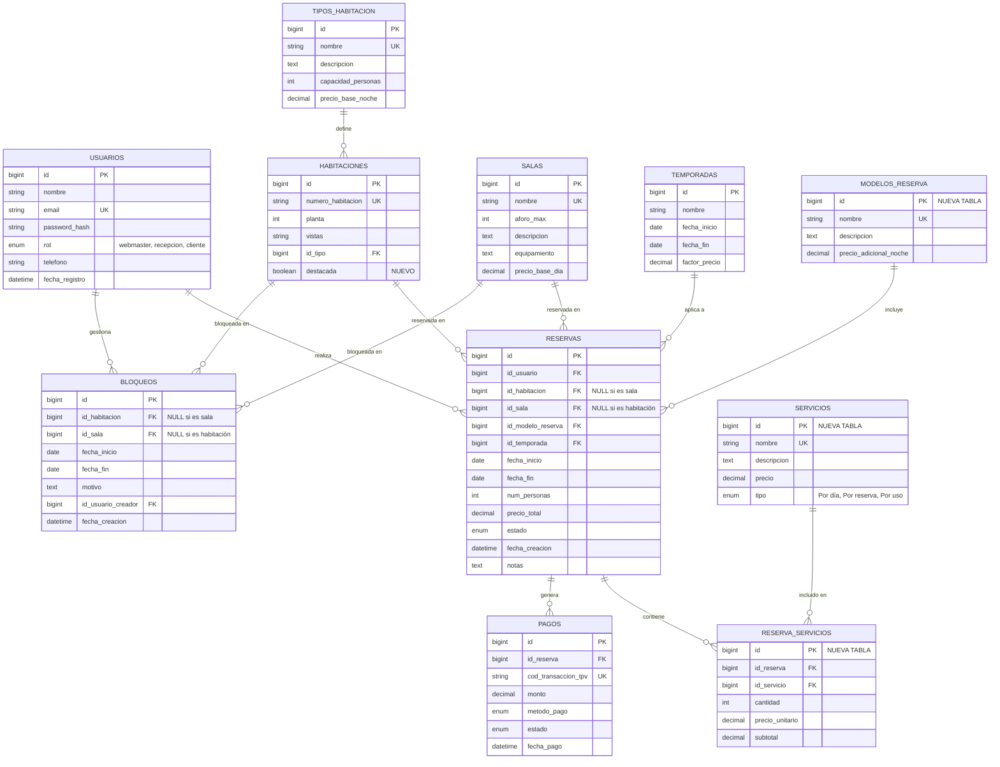

```mermaid
erDiagram
    USUARIOS ||--o{ RESERVAS : realiza
    USUARIOS ||--o{ BLOQUEOS : gestiona
    
    TIPOS_HABITACION ||--o{ HABITACIONES : define
    
    HABITACIONES ||--o{ RESERVAS : "reservada en"
    HABITACIONES ||--o{ BLOQUEOS : "bloqueada en"
    
    SALAS ||--o{ RESERVAS : "reservada en"
    SALAS ||--o{ BLOQUEOS : "bloqueada en"
    
    TEMPORADAS ||--o{ RESERVAS : "aplica a"
    
    MODELOS_RESERVA ||--o{ RESERVAS : "incluye"
    
    RESERVAS ||--o{ RESERVA_SERVICIOS : contiene
    RESERVAS ||--o{ PAGOS : genera
    
    SERVICIOS ||--o{ RESERVA_SERVICIOS : "incluido en"
    
    USUARIOS {
        bigint id PK
        string nombre
        string email UK
        string password_hash
        enum rol "webmaster, recepcion, cliente"
        string telefono
        datetime fecha_registro
    }
    
    TIPOS_HABITACION {
        bigint id PK
        string nombre UK
        text descripcion
        int capacidad_personas
        decimal precio_base_noche
    }
    
    HABITACIONES {
        bigint id PK
        string numero_habitacion UK
        int planta
        string vistas
        bigint id_tipo FK
        boolean destacada "NUEVO"
    }
    
    SALAS {
        bigint id PK
        string nombre UK
        int aforo_max
        text descripcion
        text equipamiento
        decimal precio_base_dia
    }
    
    TEMPORADAS {
        bigint id PK
        string nombre
        date fecha_inicio
        date fecha_fin
        decimal factor_precio
    }
    
    MODELOS_RESERVA {
        bigint id PK "NUEVA TABLA"
        string nombre UK
        text descripcion
        decimal precio_adicional_noche
    }
    
    SERVICIOS {
        bigint id PK "NUEVA TABLA"
        string nombre UK
        text descripcion
        decimal precio
        enum tipo "Por día, Por reserva, Por uso"
    }
    
    RESERVAS {
        bigint id PK
        bigint id_usuario FK
        bigint id_habitacion FK "NULL si es sala"
        bigint id_sala FK "NULL si es habitación"
        bigint id_modelo_reserva FK
        bigint id_temporada FK
        date fecha_inicio
        date fecha_fin
        int num_personas
        decimal precio_total
        enum estado
        datetime fecha_creacion
        text notas
    }
    
    RESERVA_SERVICIOS {
        bigint id PK "NUEVA TABLA"
        bigint id_reserva FK
        bigint id_servicio FK
        int cantidad
        decimal precio_unitario
        decimal subtotal
    }
    
    PAGOS {
        bigint id PK
        bigint id_reserva FK
        string cod_transaccion_tpv UK
        decimal monto
        enum metodo_pago
        enum estado
        datetime fecha_pago
    }
    
    BLOQUEOS {
        bigint id PK
        bigint id_habitacion FK "NULL si es sala"
        bigint id_sala FK "NULL si es habitación"
        date fecha_inicio
        date fecha_fin
        text motivo
        bigint id_usuario_creador FK
        datetime fecha_creacion
    }
```
